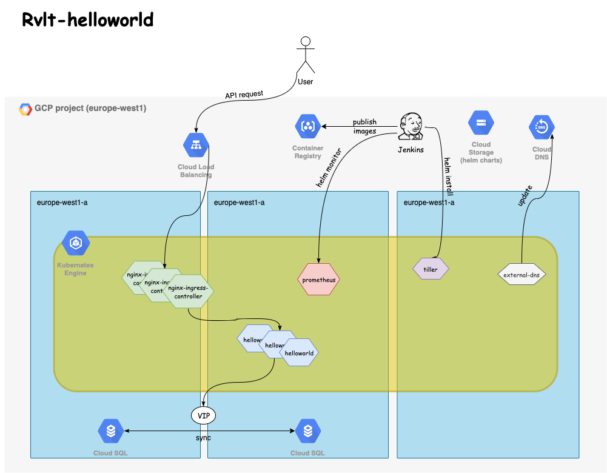

# rvlt-helloworld

## Description

`rvlt-helloworld` is a simple application that exposes an API to store the date of birth of people and retrieve how many days away is their birthday.

This solution provides:

* the Go code for the API
* an example Helm chart to deploy it to the cloud
* a `Dockerfile` used to build the image
* an integration folder containing a `docker-compose.yml` file to spin up a local environment
* a very simple example of a deployment script that could be use in a CI/CD system such as Jenkins to deploy the application (including automatic rollback)

## Requirements

In order to use this repo you need the to install Go (possibly the latest version to take advantage of the new modules management), docker/docker-compose and make.

## Architecture



This architecture describes a possible solution to deploy the Helloworld application to a cloud environment (GCP in this instance).
I've decided to use a Kubernetes cluster which spans across the three zones of the `europe-west1` region. The cluster uses Nginx as an ingress controller which is exposed as a Kubernetes service using the `LoadBalancer` mode - hence creating an actual load balancer.
The Helloworld API is exposed publicly via Nginx.

To store data the application will use a HA version of Postgres (using CloudSQL); Google automatically handles the creation two instances in two zones and the creation of a virtual IP shared across the instances that can be pointed to by the application.

The pods will be automatically spread over the three zones but it could be forced by using `nodeAffinity` and selecting a node label representing the availability zone, to make sure there are no single points of failures.

As part of the ecosystem Prometheus will be scraping metrics from the entire platform and from the Helloworld API. This is useful for both visibility and to allow automatic rollbacks of bad releases using Helm monitor.

A Jenkins instance (which could be run inside the cluster or outside) will be responsible for the CI/CD, publishing Docker images to GCR and Helm charts to a GCS bucket, and automatically deploying the application to the cluster using Helm.

The ExternalDNS component running in the cluster is responsible for listening for ingress creations and automatically generate DNS entries in CloudDNS.

## Helm chart

The Helm chart provided simply allows to deploy the application to a Kubernetes cluster and expose the service. It conists of:

* deployment: creates the actual pods
* service: creates a Kubernetes service pointing to the deployment
* ingress: exposes the service using the `ngnix-ingress-controller` which I assumed be part of the cluster already
* horizontal pod autoscaling: the number of pods increases based on the average CPU consumption

## Build and deployment

### Local build and deployment

The Makefile allows to perfom most of the required actions. To build locally run `make build` and it'll automatically build the binary in the current directory which can be used to run the application.

To fully take advantage of what is provided it's recommended to run the following steps:

```bash
make build-docker
make env-up
```

_Note that every time the environment is created it intentionally starts with a fresh database._

The above commands will build the latest version of the image and bring up two Docker containers (one for postgres and one for the helloworld API).

The API container's port is exposed on port `8080` of the host so it's possible to use `curl` to test the API.

Once finished the environment can be torn down using:

```bash
make env-down
```

### Deploy to the cloud

In order to deploy to the cloud the steps are very similar to the ones for the local deployment, but running the build commands would be performed by some CI/CD, like Jenkins. Once Jenkins builds the image successfully it'll push it to Google Container Registry (GCR). Changes to the Helm charts should also be pushed to a GCS bucket that can be used to fetch charts when deploying using Helm.

Once both container and chart have been pushed, the last step is to run a Helm command to deploy the application in a Kubernetes cluster. The script `./deployment/deploy.sh` is just an example of what could be done. Helm already takes care of rolling back automatically if for some reason the container couldn't start.
I also added the option to use `helm monitor` to monitor Prometheus metrics and rollback to a previous stable release.
In case canary is required, the deployment strategy would need to be changed to support multiple versions of the same application (Kubernetes deployments) running at the same time behind the same Kubernetes service.

## API specification

`*GET* /hello/<username>`

* 200 if the user could be found and is returned
* 404 if the user could not be found
* 500 if there was an internal error

`*PUT* /hello/<username>`

This endpoint accepts a json payload only, make sure to set the `Content-type` header to `application/json`.

* 204 if the user could be found and is returned
* 404 if the payload wasn't json or if the username or date of birth don't follow the respective format rules
* 500 if there was an internal error while storing the data into the database

## Configuration and running the application

### Configuration

```bash
./helloworld -h
Usage of ./helloworld:
  -db string
        database type (memory/postgres) (default "memory")
  -listen string
        the address to listen on (default ":8080")
  -loglevel string
        log level (debug/info/warn/fatal) (default "info")
```

### Running

```bash
POSTGRES_HOST=postgres POSTGRES_PORT=5432 POSTGRES_USER=helloworld POSTGRES_PASSWORD=password POSTGRES_DB=helloworld ./helloworld -db=postgres
```

If using the postgres database, its configuration is set using the following environment variables:

* POSTGRES_HOST: the address of the database (defaults to localhost)
* POSTGRES_PORT: the port to be used (defaults to 5432)
* POSTGRES_USER: the user to connect to the database
* POSTGRES_PASSWORD: the password to use
* POSTGRES_DB: the database name
* POSTGRES_SSLMODE: if sslmode is enabled (defaults to `disable`)

## Monitoring and health

The application exposes some fundamental metrics useful to understand if the `helloworld` is working correctly. These metrics cover the API usage and the communication with the database and can be scraped by Prometheus. Metrics are exposed on the `/metrics` endpoint.

* helloworld_http_requests_total: total number of HTTP requests by endpoint and status code
* helloworld_http_request_duration_seconds: duration of the HTTP requests by endpoint
* helloworld_database_operations_total: total number of database operations (including errors) by operation
* helloworld_database_operations_errors_total: total number of database operations errors by operation
* helloworld_database_operations_duration_seconds: duration of the database operations by operation

The health of the application is provided by the `/health` endpoint and it can be used by Kubernetes to understand if it needs to restart the pod (liveness probe) and if it can route traffic to it (readiness probe).

## Using the API

Example of usage using `curl`:

```bash
curl -XPUT http://localhost:8080/hello/john -H 'Content-type: application/json' -d '{"dateOfBirth": "2016-02-02"}'
curl http://localhost:8080/hello/john
```
